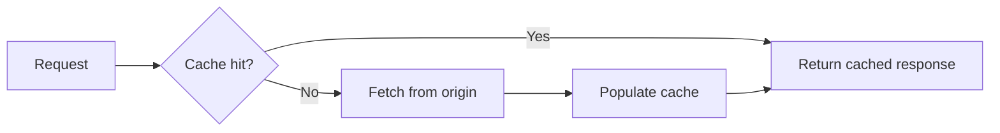

[This is a placeholder post demonstrating the MDX features available to every article: syntax highlighting, callouts, Mermaid diagrams, and math. Replace this content with your own.]

## A regular section

[Body paragraph. Write naturally — headings, lists, and inline `code` all render with the site's editorial type system automatically.]

<Callout type="tip">
  Use the `Callout` component for asides, tips, or warnings without leaving MDX.
</Callout>

## Code blocks

Every code block gets syntax highlighting and a copy button automatically:

```ts
export function add(a: number, b: number): number {
  return a + b;
}
```

## Diagrams

Mermaid diagrams render client-side:



## Math

Inline math like $E = mc^2$ and block math both work:

$$
\frac{-b \pm \sqrt{b^2 - 4ac}}{2a}
$$

## Wrapping up

[Closing paragraph — a summary, call to action, or link to related work.]
