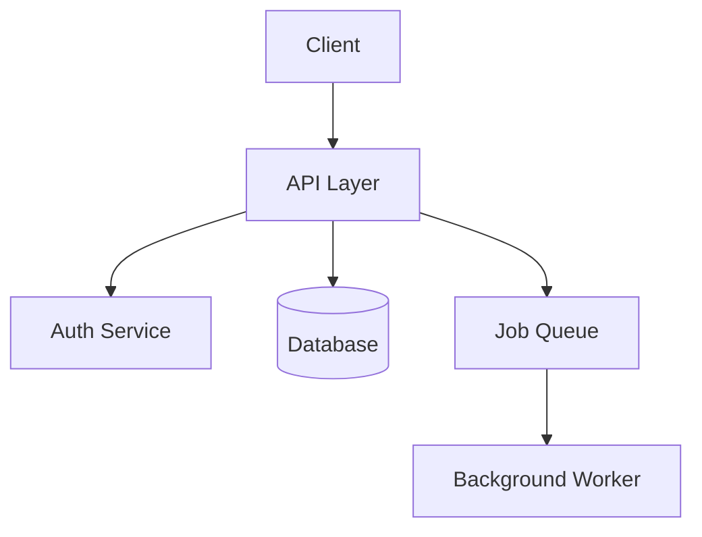

## Overview

[A short paragraph describing what the project is, who it's for, and the core problem it solves.]

## Architecture

[A paragraph walking through the diagram above — the main components and how data flows between them.]

## Tech stack

[A short explanation of why each major technology was chosen, beyond just listing it in frontmatter.]

## Challenges

[Describe one or two non-trivial problems you ran into and how you approached them.]

## Lessons learned

[What you'd do differently next time, or what surprised you during the build.]

## Future work

[What's planned next for this project, if anything.]
